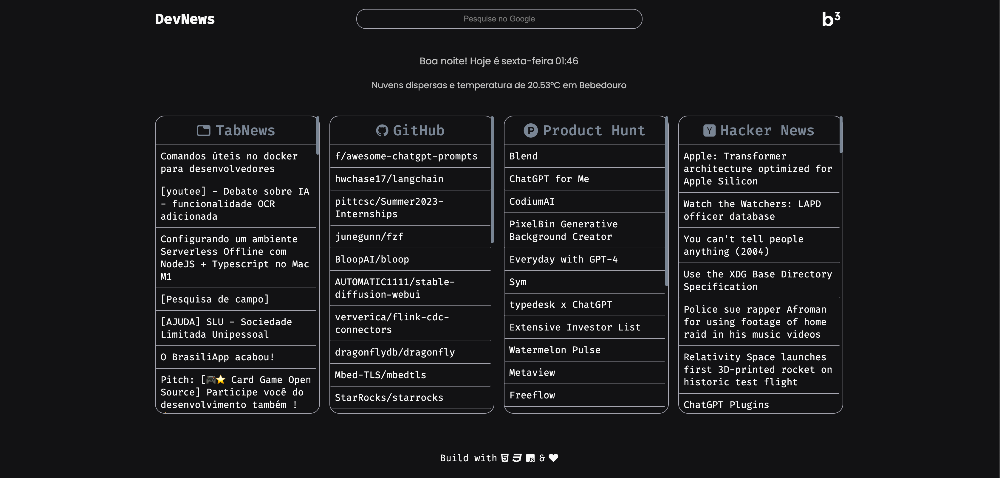

<strong><h1 align="center">DevNews</h1></strong>

  

## 🚀 Tecnologias

Esse projeto foi desenvolvido com as seguintes tecnologias:

- HTML
- CSS
- JavaScript

🌍 ## Acesse o site:

- [https://devnews.birobirobiro.dev](https://devnews.birobirobiro.dev)

## 🚧 Instalação da extensão:

- Baixe o [.zip](https://github.com/birobirobiro/dev-news/archive/refs/heads/master.zip)
- Extraia em uma pasta em seu computador
- No Google Chrome acesse a página [chrome://extensions/](chrome://extensions/)
- Ative o modo de desenvolvedor
- Clique em Load Unpacked
- Escolha a pasta extraída e pronto

---

Feito com ♥ by [birobirobiro](https://birobirobiro.dev)
